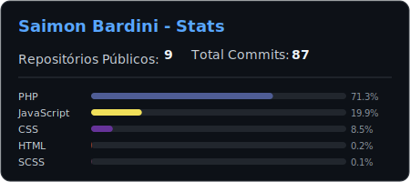

# 🧑🏼‍💻 Saimon Bardini

 
  <strong>Desenvolvimento web</strong> para empresas de pequeno e médio porte. 
  Projetos como sites, intranets, páginas de gerenciamento de dados entre outros.

  🦄 Tecnologias preferidas: PHP, JavaScript, HTML, CSS

  💼 Me ajudam muito: Tailwind CSS, Git, VS Code, MySQL

  💌 Contatos? ⤵️

  
  

  <picture>
    <source media="(prefers-color-scheme: dark)" srcset="./assets/stats.svg">
    
  </picture>

